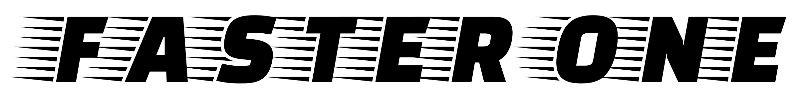
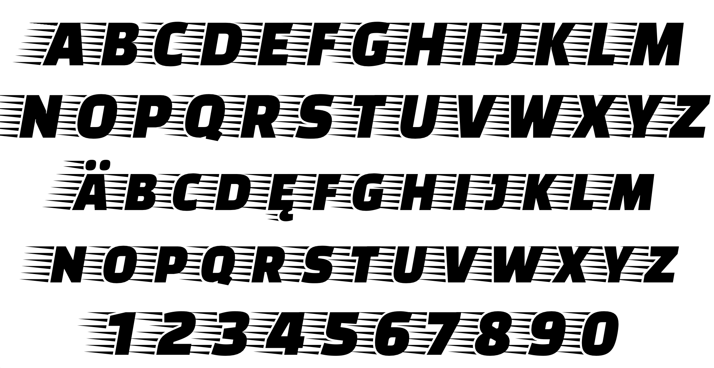

### Faster One

Faster One was developed from a sans serif italics. In order to create an impression of velocity, the horizontal and gradual lines generate the idea of the image of the wind. Ideal for writing headlines where efficiency and speed are priorities.

### Designer

* Eduardo Rodríguez Tunni

### License

Licensed under the [*SIL Open Font License, 1.1*](http://scripts.sil.org/OFL); you may not use this file except in compliance with the License.

To contribute to the project contact Eduardo Rodríguez Tunni > edu@tipo.net.ar
